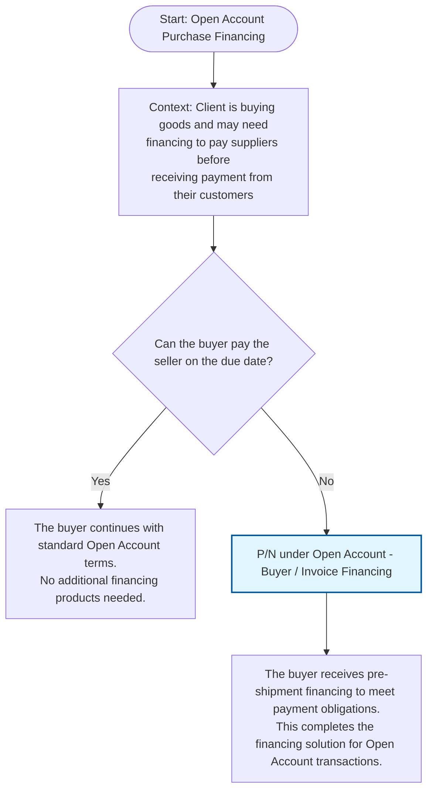

## Prompt

Create a Mermaid decision tree for Trade Open Account Purchase Financing by asking the following questions

- Can the buyer pay the seller on the due date?
  If yes, then "The buyer continues with standard Open Account terms. No additional financing products needed."
  If no, "P/N under Open Account - Buyer / Invoice Financing”

## Decision Tree

