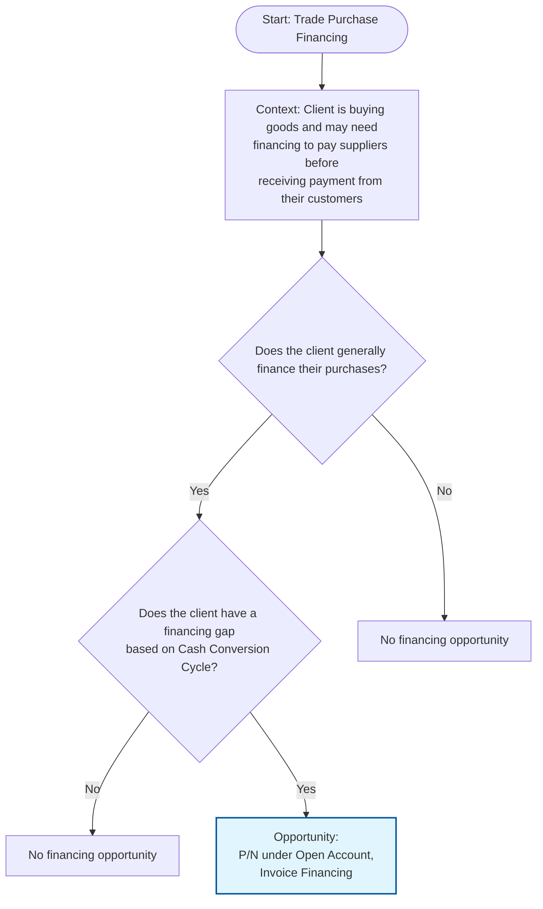

## Prompt

Create a Mermaid decision tree for Trade Open Account Purchase Financing by asking the following questions

## Decision Tree

```mermaid
flowchart TD
    A(["Start: Trade Purchase Financing"]) --> n1["Context: Client is buying goods and may need<br>financing to pay suppliers before<br>receiving payment from their customers"]
    n1 --> n2["Does the client generally finance their purchases?"]
    n2 -- Yes --> J["Does the client have a financing gap<br>based on Cash Conversion Cycle?"]
    n2 -- No --> n3["No financing opportunity"]
    J -- No --> L["No financing opportunity"]
    J -- Yes --> P1@{ label: "<span style=\"background-color:\">Opportunity:<br>P/N under Open Account, <br>Invoice Financing</span>" }

    n2@{ shape: diam}
    J@{ shape: diam}
    n3@{ shape: rect}
    P1@{ shape: rect}
    P1:::productBox
    classDef productBox fill:#e1f5fe,stroke:#01579b,stroke-width:2px
```
