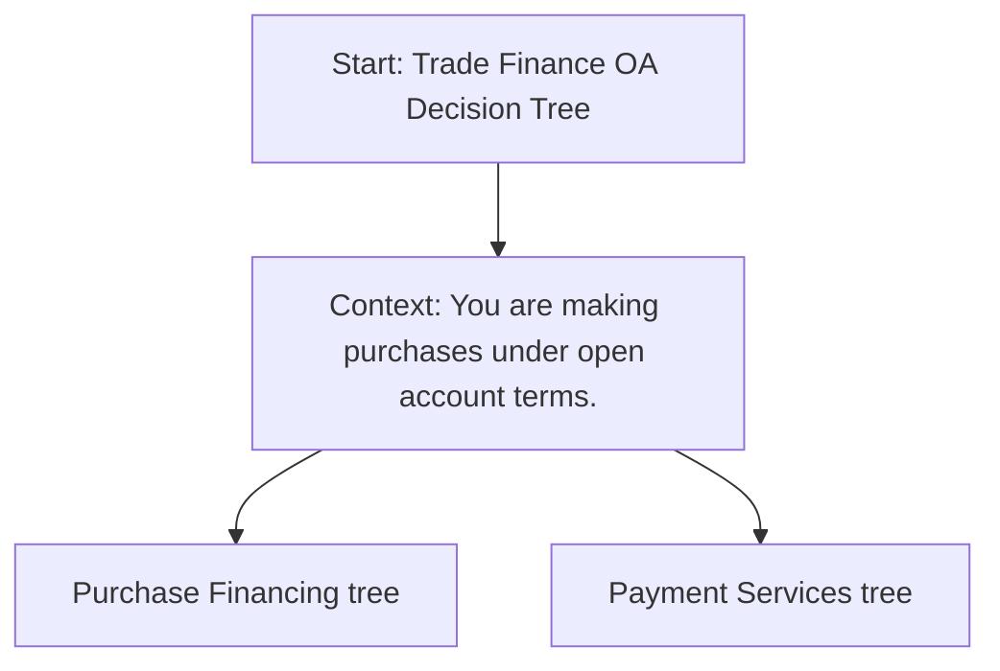

## Prompt

Create a Mermaid decision tree for Trade Finance Open Account by asking
Start with "Start: OA Decision Tree"
Then next level has 2 nodes in parallel
Purchase Financing tree
Payment Services tree

## Decision Tree

