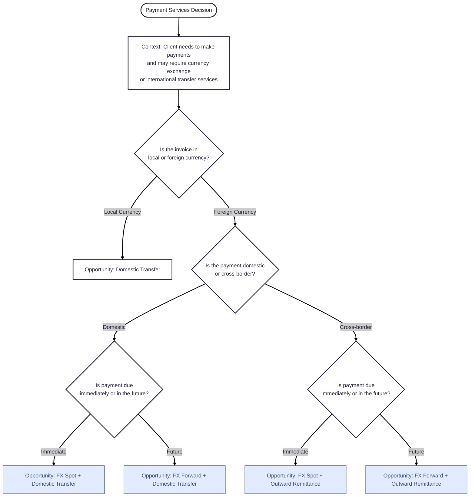

## Prompt

Create a Mermaid decision tree diagram for "Payment Services".
The products in this diagram are FX Spot/Forward and Outward Remittance.
Follow these decision questions step by step:

1. Is the invoice in local or foreign currency?

   - If Local Currency → "Domestic Transfer"
   - If Foreign Currency → continue.

2. If Foreign: Is the payment domestic or cross-border?
   - If Domestic → ask: Is payment due immediately or in the future?
     - If Immediate → "Opportunity: FX Spot only + Domestic Transfer"
     - If Future → "Opportunity: FX Forward only + Domestic Transfer"
   - If Cross-border → ask: Is payment due immediately or in the future?
     - If Immediate → "Opportunity: FX Spot + Outward Remittance"
     - If Future → "Opportunity: FX Forward + Outward Remittance"

### Decision Tree

