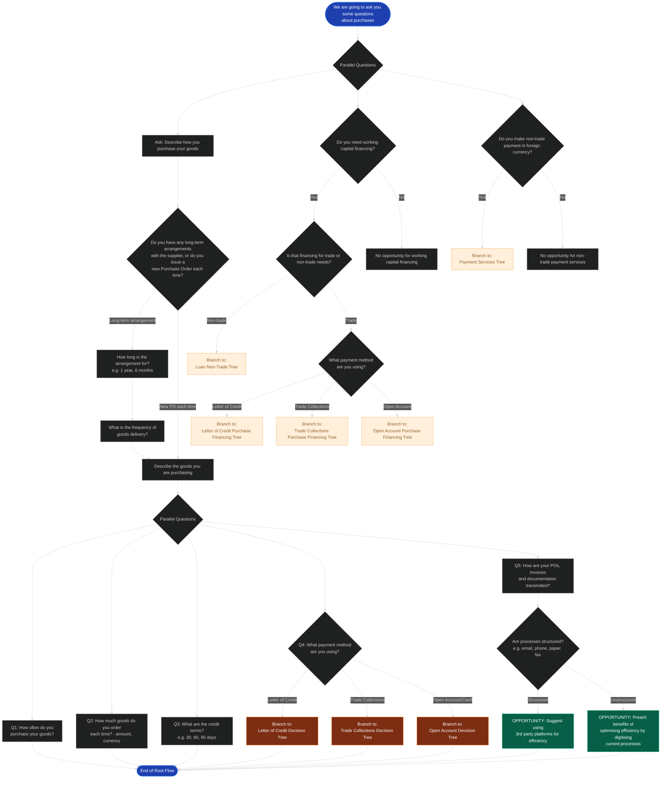

# Root Decision Tree - Purchase Goods Flow

```mermaid
%%{init: {'theme':'dark'}}%%

flowchart TD
    Start(["We are going to ask you some questions<br>about purchases"]) --> n11["Parallel Questions"]
    Q1["Ask: Describe how you purchase your goods"] --> Q2{"Do you have any long-term arrangements<br>with the supplier, or do you issue a<br>new Purchase Order each time?"}
    Q2 -- "Long-term arrangement" --> LT1["How long is the arrangement for?<br>e.g. 1 year, 6 months"]
    LT1 --> LT2["What is the frequency of<br>goods delivery?"]
    Q2 -- New PO each time --> GOODS["Describe the goods you are purchasing"]
    GOODS --> PARALLEL{"Parallel Questions"}
    PARALLEL --> P1["Q1: How often do you<br>purchase your goods?"] & P2["Q2: How much goods do you order<br>each time? - amount, currency"] & P3["Q3: What are the credit terms?<br>e.g. 30, 60, 90 days"] & P4{"Q4: What payment method<br>are you using?"} & P5["Q5: How are your POs, Invoices<br>and documentation transmitted?"]
    P4 -- Letter of Credit --> LOC["Branch to:<br>Letter of Credit Decision Tree"]
    P4 -- Trade Collections --> TC["Branch to:<br>Trade Collections Decision Tree"]
    P4 -- Open Account/Cash --> OA["Branch to:<br>Open Account Decision Tree"]
    P5 --> D1{"Are processes structured?<br>e.g. email, phone, paper, fax"}
    D1 -- Structured --> OPP2["OPPORTUNITY: Suggest using<br>3rd party platforms for efficiency"]
    D1 -- Unstructured --> OPP3["OPPORTUNITY: Preach benefits of<br>optimising efficiency by digitising<br>current processes"]
    LOC --> END(["End of Root Flow"])
    TC --> END
    OA --> END
    OPP2 --> END
    OPP3 --> END
    P1 --> END
    P2 --> END
    P3 --> END
    LT2 --> GOODS
    n1["Do you need working capital financing?"] -- Yes --> n8["Is that financing for trade or non-trade needs?"]
    n8 -- "Non-trade" --> n4@{ label: "<span style=\"color:\">Branch to:</span><br style=\"--tw-scale-x:\"><span style=\"color:\">Loan Non-Trade Tree</span>" }
    n1 -- No --> n3["No opportunity for working capital financing"]
    n6["Do you make non-trade payment in foreign currency?"] -- Yes --> n7@{ label: "<span style=\"--tw-scale-x:\">Branch to:</span><br style=\"--tw-scale-x:\"><span style=\"--tw-scale-x:\">Payment Services Tree</span>" }
    n8 -- Trade --> n12@{ label: "What payment method<br style=\"--tw-scale-x:\">are you using?" }
    n6 -- No --> n10["No opportunity for non-trade payment services"]
    n11 --> Q1 & n1 & n6
    n12 -- Letter of Credit --> n2@{ label: "<span style=\"color:\">Branch to:</span><br style=\"--tw-scale-x:\"><span style=\"color:\">Letter of Credit Purchase Financing Tree</span>" }
    n12 -- Trade Collections --> n13@{ label: "<span style=\"--tw-scale-x:\">Branch to:</span><br style=\"--tw-scale-x:\"><span style=\"--tw-scale-x:\">Trade Collections Purchase Financing Tree</span>" }
    n12 -- Open Account --> n14@{ label: "<span style=\"--tw-scale-x:\">Branch to:</span><br style=\"--tw-scale-x:\"><span style=\"--tw-scale-x:\">Open Account Purchase Financing Tree</span>" }

    n11@{ shape: diam}
    n1@{ shape: diam}
    n8@{ shape: diam}
    n4@{ shape: rect}
    n3@{ shape: rect}
    n6@{ shape: diam}
    n7@{ shape: rect}
    n12@{ shape: diam}
    n10@{ shape: rect}
    n2@{ shape: rect}
    n13@{ shape: rect}
    n14@{ shape: rect}
     n4:::Peach
     n7:::Peach
     n2:::Peach
     n13:::Peach
     n14:::Peach
    classDef Peach stroke-width:1px, stroke-dasharray:none, stroke:#FBB35A, fill:#FFEFDB, color:#8F632D
    style Start fill:#1e40af,stroke:#3b82f6,color:#fff
    style LOC fill:#7c2d12,stroke:#f97316,color:#fff
    style TC fill:#7c2d12,stroke:#f97316,color:#fff
    style OA fill:#7c2d12,stroke:#f97316,color:#fff
    style OPP2 fill:#065f46,stroke:#10b981,color:#fff
    style OPP3 fill:#065f46,stroke:#10b981,color:#fff
    style END fill:#1e40af,stroke:#3b82f6,color:#fff
```
